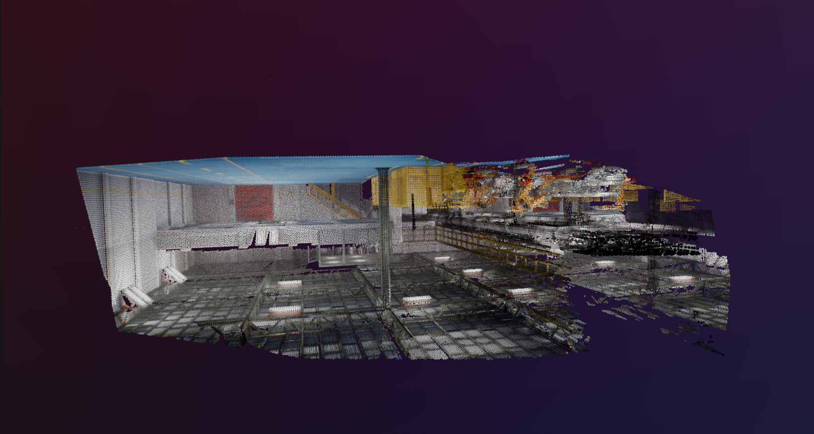

# OP-LIMap
#mobilerobotics project
##Example-Car Factory




# Installation

## Cloning The Repo

This repository has multiple nested Git `submodules`, so the cloning procedure is *slightly* more complex than usual. To clone the entirety of the repository:
```
git clone https://github.com/RaghavM11/LIMap-Extension.git
cd LIMap-Extension/
git submodule update --init --recursive
```

## Installation via `pipenv`

There's multiple ways to install this correctly, but Dylan likes `pipenv` and it seems to work okay for him.

Tested on:
- Ubuntu 20.04
- CMake version 3.17
-

The process is:

### Via Installation Script

While it is not perfect by any means, we have attempted to write a comprehensive installation script. This script:
- Verifies that your `cmake` version is compatible with LIMap
- Recursively updates the submodules in case you forgot to do so in [Cloning the Repo](#cloning-the-repo)
- Attempts to find `colmap` and `PoseLib` via CMake, though this is easily the most brittle of the steps.
- Checks `apt` dependencies are installed for LIMap
  - The script does not download these so as to preserve the system's state.
- Installs `asdf` for downloading Python executables for virtual environments
- Installs `pipenv` for Python virtual environment management (a personal favorite of Dylan's)
- Installs the `pipenv` environment Dylan used for the project
  - This:
    -  installs Python 3.9 via `asdf`
    -  installs all LIMap Python dependencies
    -  installs LIMap
- Finally, this script overrides a file in one of the third-party directories.
  - This is likely due to LIMap not specifying a version requirement for Hierarchical-Localization, as they updated to using `pathlib.Path` instead of `os.path` among other syntactic changes.

### Manual Install

1. Follow LIMAP installation (apt packages included), up to the point where you need to start installing Python dependencies (minus opencv).
	1. This includes installing colmap, building poselib, etc.
		1. Don't install torch or torchvision yet but do apt-install opencv libraries and such.
	2. Make sure your cmake is 3.17 or greater, I downloaded 3.17 and prepended the binary's parent path to my `PATH` variable.
		1. **THIS IS CRUCIAL**!
2. Install pipenv with `pip install pipenv`
3. In the LIMap-Extension directory, create pipenv environment with `pipenv install --python 3.9 --site-packages`
   1. If you do not have Python 3.9 and don't have certain packages necessary to fetch new Python versions, you'll get an error. Just follow the instructions in the error to install packages for fixing this.
4. Install pytorch and torchvision with
```bash
pipenv install torch==1.13.1 torchvision==0.14.1 --index https://download.pytorch.org/whl/cu116
```
1. Install limap dependencies. **It is very important that this is done from the LIMap-Extension directory and not the limap sub-directory.**
```bash
pipenv install -r ./limap/requirements.txt
```
1. Install limap
```bash
pipenv install -vv -e ./limap
```
1. Attempt to run a job. If the job fails due to not being able to find a third party library that LIMap uses, do the following:
```bash
pipenv install -vv -e ./limap/third-party/[THIRD PARTY PACKAGE THAT WASN'T FOUND]
```

## Installation via Anaconda

1. Setup Conda env. (should have miniconda installed)
````
conda create -n myenv python=3.9 
````
2. Activate conda 

```
conda activate myenv

```
3. Install dependecies in conda env following Via Installation Script (mentioned above)

4. install package

```
python -m pip install -Ive ./limap 
```

4. To double check if the package is successfully installed:
```
python -c "import limap"
```
## Setup

1. For above example the files can be found [here](https://drive.google.com/drive/folders/1uz8lHUS8D6lQXlfJ6VKLXTvqKEMv0B_E?usp=sharing) 

##todo script
Downloader script for sample dataset uploaded to drive (small, ~100 images)


# For running examples
## To run line mapping using Fitnmerge (line mapping with available depth maps) on Hypersim:
```
python limap/runners/hypersim/fitnmerge.py --output_dir limap/outputs/quickstart_fitnmerge
```

## To run Visualization of the 3D line maps after the reconstruction:

```
python limap/visualize_3d_lines.py --input_dir outputs/quickstart_triangulation/finaltracks \
                             # add the camera frustums with "--imagecols outputs/quickstart_triangulation/imagecols.npy"
```

## For Hybrid Loaclization of Points and Lines using NN detectors

```
python limap/runners/tests/localization.py --data limap/runners/tests/data/localization/localization_test_data_stairs_1.npy
```
